# Credit Card Customer Segmentation

<p align="center">
  
  
  
  
  
  
</p>

<p align="center">
  <b>Unsupervised learning project to segment credit card customers using K-Means, Hierarchical Clustering, and DBSCAN.</b>
</p>

<p align="center">
  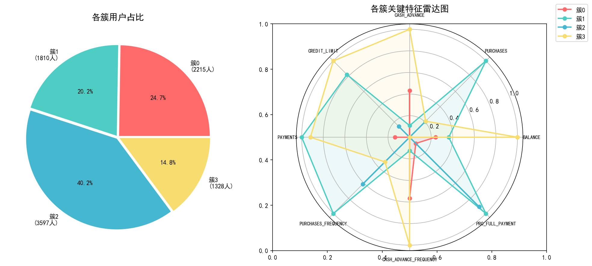
</p>

---

## 📋 Table of Contents

1. [Project Overview](#-project-overview)
2. [Innovation Highlights](#-innovation-highlights)
3. [Dataset Description](#-dataset-description)
4. [Data Cleaning](#-data-cleaning)
5. [Exploratory Data Analysis](#-exploratory-data-analysis)
6. [Clustering Analysis](#-clustering-analysis)
7. [Model Evaluation](#-model-evaluation)
8. [Cluster Interpretation](#-cluster-interpretation)
9. [Output Files](#-output-files)
10. [How to Run](#-how-to-run)
11. [Repository Structure](#-repository-structure)
12. [Limitations & Future Work](#-limitations--future-work)


---

## 📖 Project Overview

This **credit card customer segmentation** project applies unsupervised clustering techniques to a real-world financial dataset containing **8,950 customers** and **18 behavioral features**. The goal is to identify distinct customer groups based on their spending habits, payment behavior, and credit usage, enabling **targeted marketing** and **risk management strategies** in the retail banking scene.

## Dataset Source
**Dataset**: [Kaggle - Credit Card Dataset for Clustering](https://www.kaggle.com/datasets/arjunbhasin2013/ccdata)
- Author: Arjun Bhasin
- License: CC0: Public Domain
- File: `CC GENERAL.csv`
- Description: Contains 6-month consumption behavior records of nearly 9000 credit card users with 18 behavioral features for customer segmentation clustering experiments.

---

## ✨ Innovation Highlights

1. **Multi-Algorithm Benchmarking**: Side-by-side comparison of K-Means, Hierarchical Clustering, and DBSCAN using three quantitative metrics to objectively select the best model for credit card clustering.
2. **Business-Oriented Feature Engineering**: Beyond raw fields, domain-specific behavioral features are constructed to amplify user stratification differences in the credit card customer segmentation scenario.
3. **End-to-End Pipeline**: A complete industrial data analysis workflow from raw data cleaning → EDA → dimensionality reduction → modeling → evaluation → user profiling → actionable marketing and risk control strategies.
4. **Full Visual Coverage**: 19 charts covering data distribution, correlation, dimensionality reduction, clustering, and segment profiling — results are intuitive and interpretable.
5. **Actionable Business Output**: Not just cluster labels, but targeted financial operation and risk control plans for each of the 4 customer segments.

---

## 📊 Dataset Description

The dataset contains **8,950 credit card users** with their last 6-month transaction behavior records.

| Feature | Type | Description |
|---------|------|-------------|
| `CUST_ID` | string | Unique customer identifier |
| `BALANCE` | float | Current account balance |
| `BALANCE_FREQUENCY` | float | Balance update frequency (0~1) |
| `PURCHASES` | float | Total purchase amount |
| `ONEOFF_PURCHASES` | float | One-off purchase amount |
| `INSTALLMENTS_PURCHASES` | float | Installment purchase amount |
| `CASH_ADVANCE` | float | Total cash advance amount |
| `PURCHASES_FREQUENCY` | float | Purchase frequency (0~1) |
| `ONEOFF_PURCHASES_FREQUENCY` | float | One-off purchase frequency (0~1) |
| `PURCHASES_INSTALLMENTS_FREQUENCY` | float | Installment purchase frequency (0~1) |
| `CASH_ADVANCE_FREQUENCY` | float | Cash advance frequency (0~1) |
| `CASH_ADVANCE_TRX` | int | Number of cash advance transactions |
| `PURCHASES_TRX` | int | Number of purchase transactions |
| `CREDIT_LIMIT` | float | Credit card limit |
| `PAYMENTS` | float | Total payment amount |
| `MINIMUM_PAYMENTS` | float | Minimum payment amount |
| `PRC_FULL_PAYMENT` | float | Full payment ratio (0~1) |
| `TENURE` | int | Card tenure in months |

---

## 🧹 Data Cleaning

One of the most important preprocessing steps in a Data Science project. In this project, I imputed missing values with the median value, dropped the `CUST_ID` column, then normalized the input values using `StandardScaler()`. You can check the full code in [credit_card.ipynb](./credit_card.ipynb).

- **Missing Values**: `MINIMUM_PAYMENTS` missing 313 rows (3.50%), `CREDIT_LIMIT` missing 1 row (0.01%). Filled with median.
- **Outliers**: Detected using IQR method and treated with Winsorization (clipped to `[Q1 - 1.5*IQR, Q3 + 1.5*IQR]`).

---

## 🔍 Exploratory Data Analysis

### Correlation Check

Before clustering, I checked the correlation between features to understand relationships and potential multicollinearity.

<p align="center">
  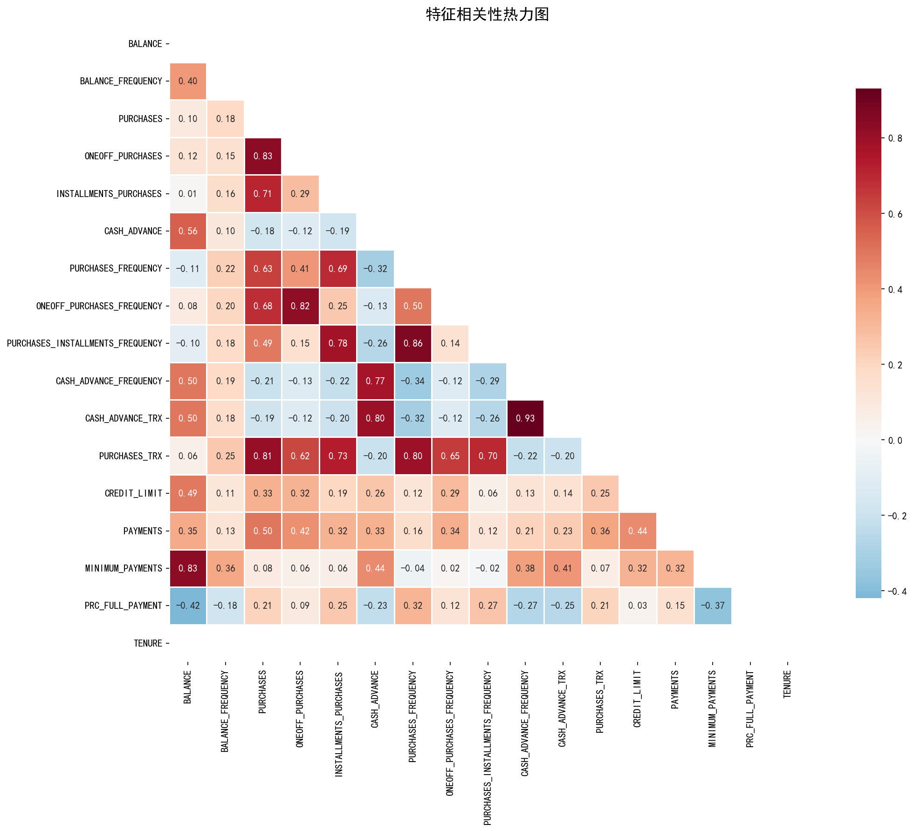
</p>

### Feature Distribution

Histograms of all features reveal skewed distributions typical of financial data, justifying the need for standardization before distance-based clustering.

<p align="center">
  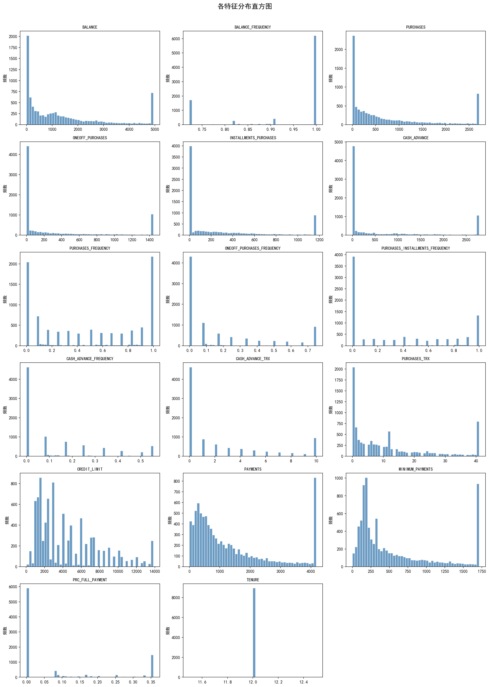
</p>

---

## 🤖 Clustering Analysis

### PCA Analysis

Principal Component Analysis (PCA) was applied after standardization to reduce dimensionality while preserving variance. The scatter plot below shows the data distribution in the first two principal components.

<p align="center">
  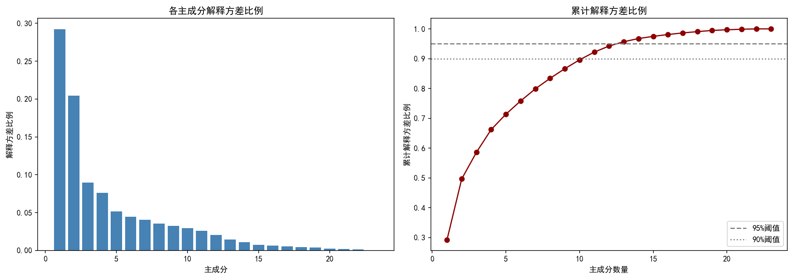
</p>

### K-Means Clustering

To determine the optimal number of clusters, I used the **Elbow Method** and **Silhouette Score** together. The results suggest **K = 4** as the best choice.

<p align="center">
  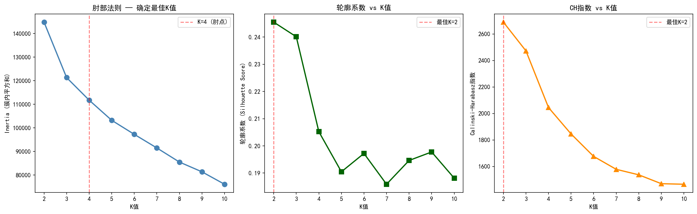
</p>

The final K-Means model was trained with `n_clusters=4`, `random_state=42`, and `n_init=10`. Below is the 2D PCA projection of the clustering result.

<p align="center">
  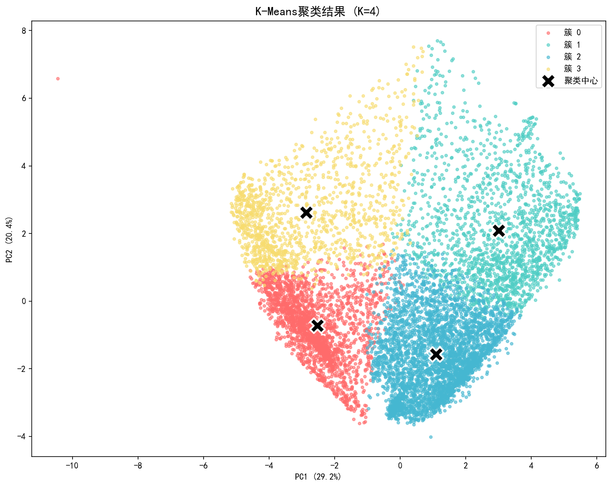
</p>

### Hierarchical Clustering

I also built an **Agglomerative Clustering** model using Ward's linkage. The dendrogram helps visualize the merging process and confirms the 4-cluster structure.

<p align="center">
  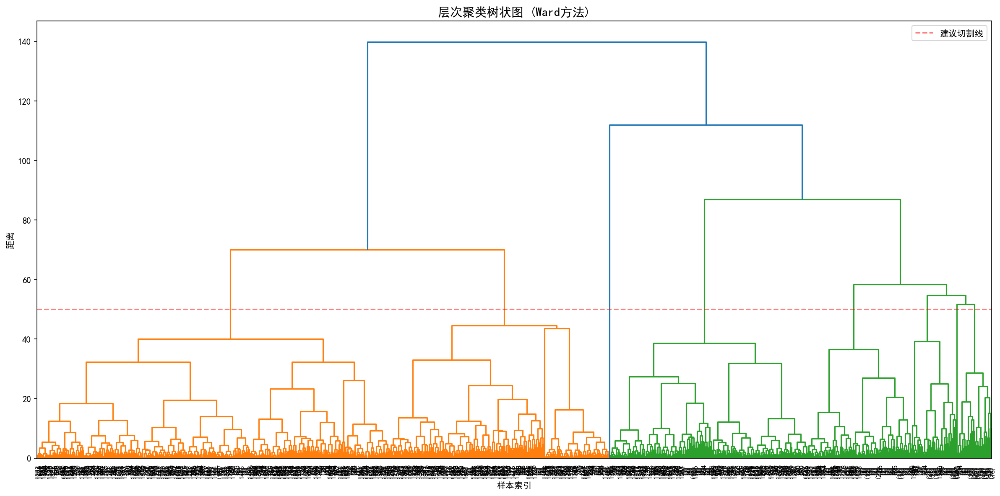
</p>

<p align="center">
  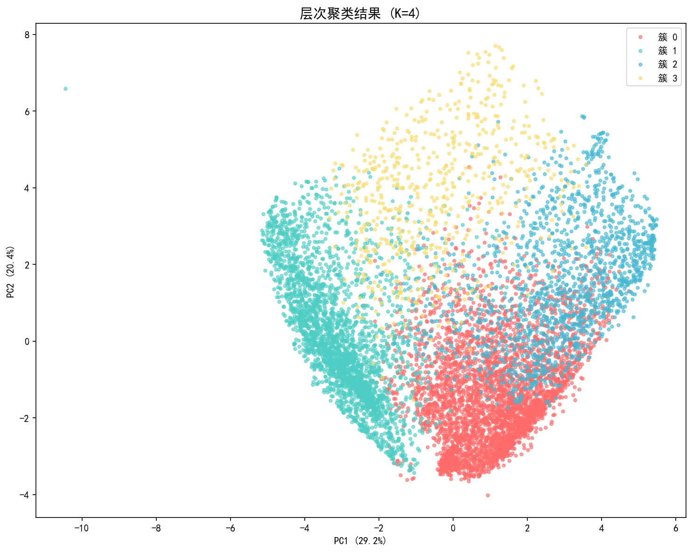
</p>

### DBSCAN Clustering

For density-based clustering, DBSCAN was applied with `eps=1.0` and `min_samples=5`. However, DBSCAN performed poorly on this dataset: it identified **24 clusters** and marked **43.4%** of the data as noise.

> **Why DBSCAN failed here**: The customer behavior density in this credit card dataset is relatively uniform, lacking sharp density boundaries between groups. Meanwhile, a large number of low-frequency, low-spending users were labeled as noise. This makes DBSCAN unsuitable for general customer segmentation in this scenario, though it could still be useful for detecting anomalous cash-advance behavior.

<p align="center">
  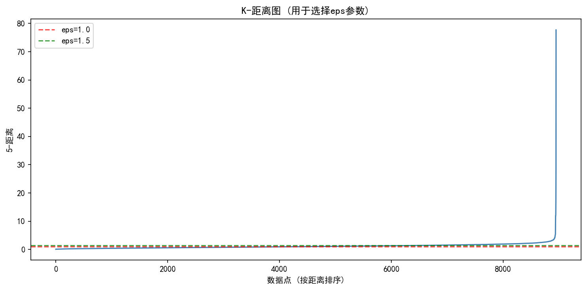
</p>

<p align="center">
  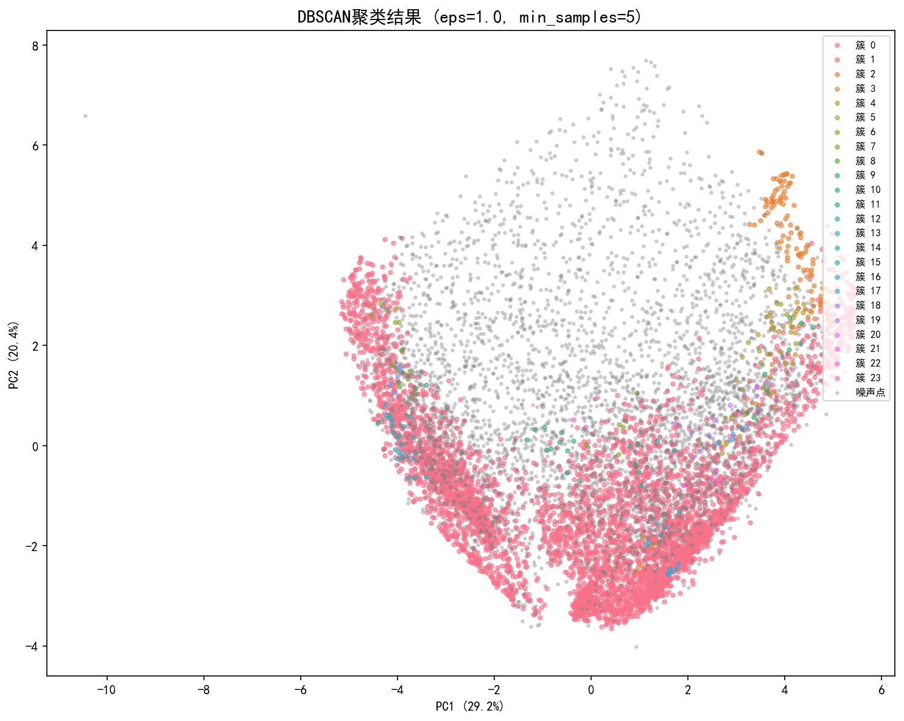
</p>

---

## 📈 Model Evaluation

Three metrics were used to evaluate clustering quality: **Silhouette Score**, **Davies-Bouldin Index**, and **Calinski-Harabasz Index**.

| Algorithm | Clusters | Silhouette ↑ | Davies-Bouldin ↓ | Calinski-Harabasz ↑ |
|-----------|----------|--------------|------------------|---------------------|
| **K-Means** | **4** | **0.2052** | **1.6158** | **2044.74** |
| Hierarchical | 4 | 0.1983 | 1.6511 | 1694.20 |
| DBSCAN | 24 | -0.3117 | 1.0921 | 29.63 |

<p align="center">
  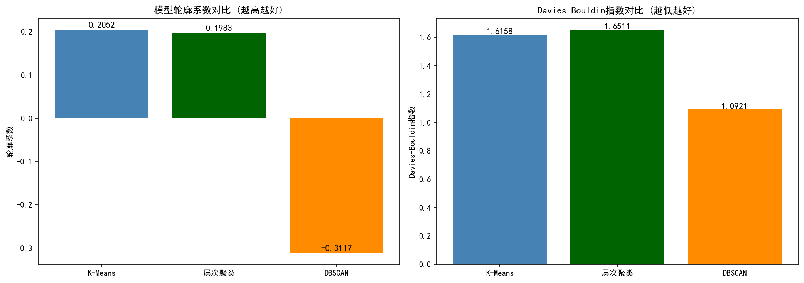
</p>

**K-Means** achieved the best overall performance for this credit card customer segmentation task, with the highest Silhouette Score and Calinski-Harabasz Index, indicating well-separated and compact clusters.

---

## 👥 Cluster Interpretation

### Cluster Profile (Radar Chart)

The radar chart compares the four clusters across key behavioral dimensions.

<p align="center">
  
</p>

### Cluster Heatmap

The heatmap below shows the standardized mean values of each feature per cluster, making it easy to spot group differences.

<p align="center">
  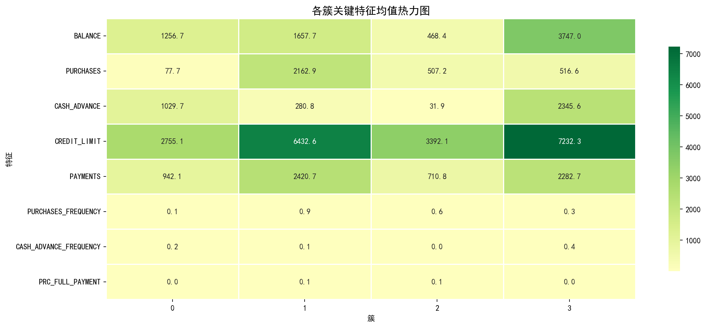
</p>

### Customer Personas

| Cluster | Persona | Key Behavior | Suggested Strategy |
|---------|---------|--------------|--------------------|
| 0 | High-Value Active | High purchases, full payment tendency | VIP upgrade, premium products |
| 1 | Conservative | Low balance, low activity, long tenure | Savings products, reactivation campaigns |
| 2 | Cash-Dependent | High cash advance, low purchases | Limit cash advance, push installment plans |
| 3 | Growth Potential | Moderate spending, installment preference | Offer installment discounts, increase stickiness |

---

## 📁 Output Files

After running the notebook, the following files are generated:

1. **`charts/` folder**: 19 analytical visualization charts auto-saved in high resolution (150 DPI).
2. **`result_file/clustering_result.csv`**: User ID + cluster label + customer segment type.
3. **`result_file/data_with_clusters.csv`**: Full original features + cluster labels from all three algorithms, supporting secondary deep analysis.

---

## ⚙️ How to Run

### 1. Install Dependencies

```bash
pip install numpy pandas matplotlib seaborn scikit-learn scipy
```

### 2. Launch Notebook

```bash
jupyter notebook credit_card.ipynb
```

### 3. Run All Cells

Execute cells in order. Charts will be saved to `charts/`, and clustering results to `result_file/`.

### ⚠️ Notes

1. The notebook contains a `SAVE_DIR` variable pointing to a local path. Please update it to your local project folder before running.
2. Place the dataset `CC GENERAL.csv` in the project root directory.
3. For Chinese character display issues in plots, install the SimHei font or modify the `plt.rcParams['font.sans-serif']` setting in the notebook.

---

## 🗂️ Repository Structure

```
.
├── credit_card.ipynb                 # Main analysis notebook
├── CC GENERAL.csv                    # Raw dataset (Kaggle)
├── charts/                           # 19 generated visualizations
├── result_file/                      # Clustering output CSVs
│   ├── clustering_result.csv         # Cluster summary statistics
│   └── data_with_clusters.csv        # Full data with cluster labels
├── 字段说明.txt                       # Feature dictionary (Chinese)
└── readme.md                         # Project documentation
```

---

## 📌 Limitations & Future Work

1. **Static Data Only**: The current model uses a single 6-month snapshot. Time-series dynamic behavior is not captured.
2. **Future Improvement 1**: Integrate RFM (Recency, Frequency, Monetary) model with clustering to further refine customer value layers.
3. **Future Improvement 2**: Introduce supervised labels to build a customer churn prediction model on top of segmentation.
4. **Future Improvement 3**: Experiment with Gaussian Mixture Models (GMM) to compare probabilistic clustering effects.
5. **Future Improvement 4**: Deploy the K-Means model as a batch/real-time scoring service for monthly customer tag updates.

---

